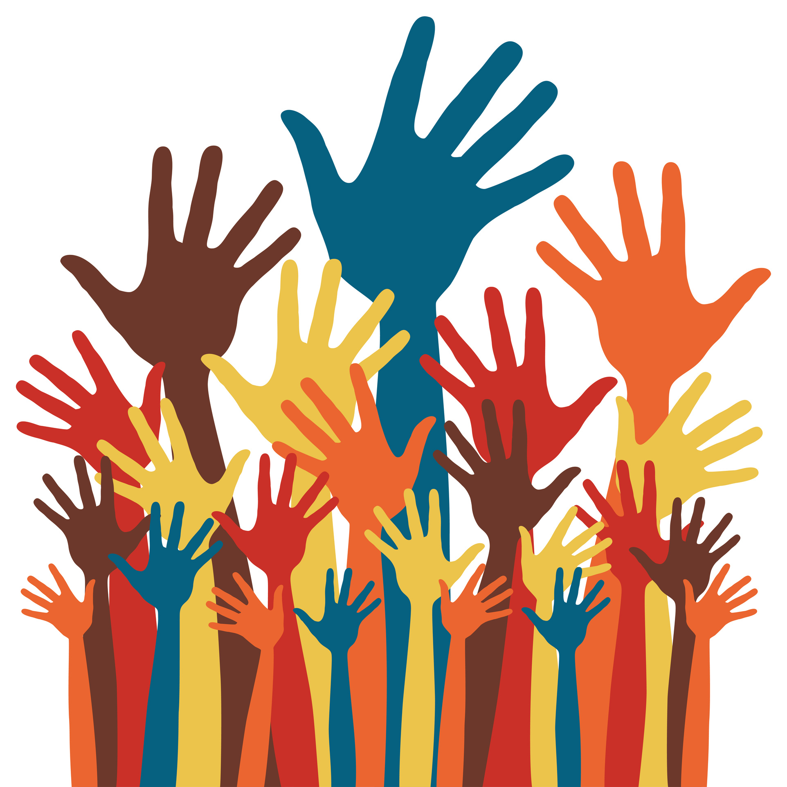
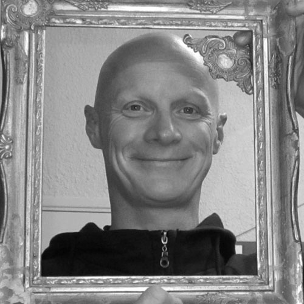

# L'association

Atelier partagé, La FABrique du Loch est accessible à tous pour presque tout faire : apprendre, inventer, fabriquer, réparer . Des outils classiques et numériques sont mis à disposition des membres du FabLab pour réaliser leurs projets, qu’ils soient individuels ou collectifs, farfelus ou sérieux.

Le principe fondamental d’un FabLab est de « faire ensemble » et de « partager les connaissances ». La FABrique du Loch est un lieu d’échange intergénérationnel et interdisciplinaire, où chacun vient, quel que soit son niveau, dans un esprit de convivialité et de tolérance.

La FABrique du Loch est soutenue par la Mairie et le Pays d’Auray, qui accompagnent le projet depuis l’origine.

Site de la mairie

Le règlement intérieur

## Les fondateurs
L’idée est née en 2014 sous l’impulsion de quatre amis
- Patrick Jullien préparateur de bateaux de course,
- Benjamin Muyl architecte naval,
- Stéphanie Fiévé architecte DPLG, et
- Arnaud Schweitzer chef de projet.

Chacun a apporté une pierre à l’édifice afin de monter l’association qui a vu le jour en juillet 2015.

## Notre fabmanager

Juju

Fabmanager
