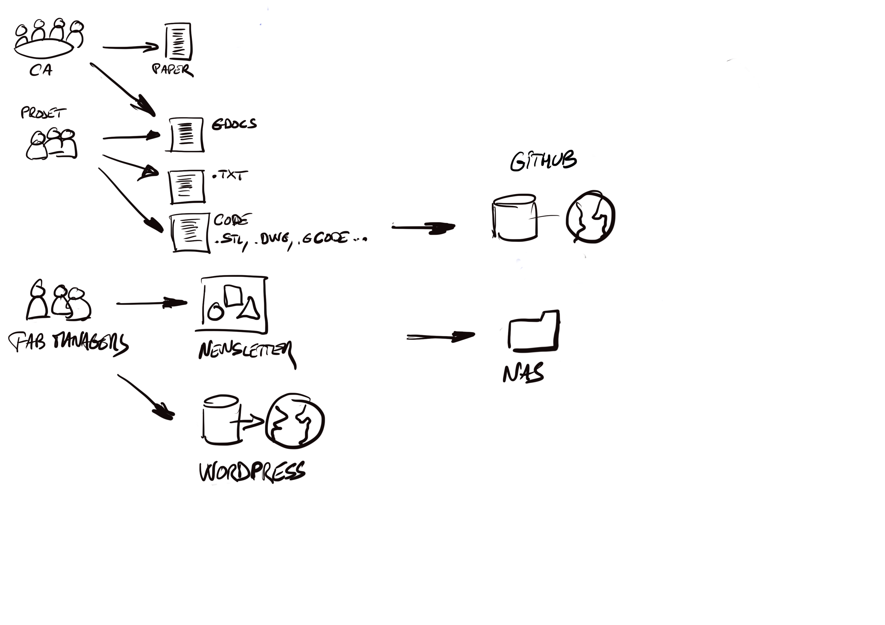

# La situation aujourd'hui
La Fabrique du Loch, comme toute organisation, exploite plusieurs médias numériques
entre ses adhérents, ses partenaires extérieurs.

## Les documents de la Fabrique
La Fabrique du Loch produit des centaines de documents par mois.

Ces documents peuvent prendre sous la forme d'un **fichier
sous tout format** (texte, .doc, .ppt, .pdf mais aussi .stl, .dwg, .gcode...)
ou un document sur le cloud permettant une interaction collaborative en temps réel
comme **Dropbox Paper**, utilisé pour les réunions du Conseil d'Administration et par quelques projets,
ou **Google Drive** utilisé depuis la gestation de l'association.

Ainsi, pour la production de documents texte

## Le NAS, un serveur de fichier
Un serveur de fichiers (NAS) est utilisé pour stocker localement les fichiers et les rendre acessible à
tous les ordinateurs de la Fabrique du Loch.

L'accès depuis des ordinateurs distants a été étudié
mais la garantie d'une sécurisation suffisante n'était pas démontrée.

## Les Newsletters
Les newsletters sont produites mensuellement et remises aux membres sous forme d'une image.
Il est ainsi impossible de copier du texte provenant d'une newsletter.

## Le Site Web
Développé sur la base d'un moteur WordPress, le site web est aujourd'hui difficile à maintenir.
Les mises à jour fréquentes des nombreuses extensions utilisées peuvent bloquer la publication.
Certains blocs n'apparaissent plus comme les machines ou les projets.
