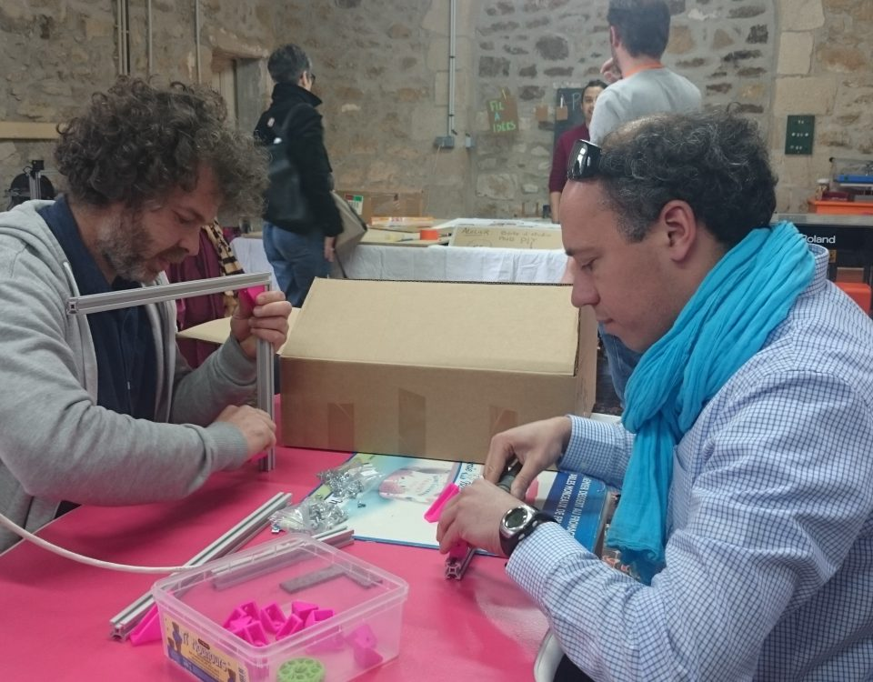

## Un Fablab, c'est quoi ?
C’est à la fois un lieu de fabrication d’objets et de partage de connaissances.

Un fab lab (contraction de l’anglais "fabrication laboratory", laboratoire de fabrication) est un lieu ouvert au public où sont mis à disposition des outils de toutes sortes, notamment des machines-outils pilotées par ordinateur, pour la conception et la réalisation d’objets. Un fab lab, c'est aussi un lieu d'échanges et de partage des connaissances où toute personne, quels que soient son niveau de connaissance et ses moyens, peut venir se servir des machines mises à disposition pour réaliser ses projets personnels, scolaires ou commerciaux.

### A qui s’adresse la FABrique du Loch ?
À tous ceux qui ont un projet à réaliser, qu’il soit gros ou petit, simple ou compliqué.
- Aux personnes qui souhaitent apprendre à se servir d’un fer à souder, d’une imprimante 3D, d’une découpe laser ou d’une foule d’autres outils encore.
- Aux entreprises et aux start-up qui cherchent à réaliser un projet ou un espace de travail pour grandir et collaborer.
- Aux travailleurs indépendants qui cherchent un espace de travail partagé (openspace)
- Aux personnes qui cherchent à se former sur notre parc de machines à commande numérique
- Aux groupes scolaires qui cherchent à réaliser un projet.

### La charte des Fab Labs
Afin de porter l’appellation de « FabLab », la structure doit entre autres respecter la charte des FabLabs, mise en place par le MIT.

#### Mission
Les fablabs sont rassemblés en réseau mondial de laboratoires locaux. Ils rendent l’invention possible en ouvrant aux individus l’accès à des outils à commande numérique.

#### Accès
Vous pouvez utiliser le fab lab pour fabriquer à peu près n’importe quoi (dès lors que cela ne nuit à personne). Vous devez apprendre à le fabriquer par vous-même et vous devez partager l’usage du lab avec les autres utilisateurs.

#### Education
La formation dans le fab lab s’appuie sur des projets et sur  l’apprentissage par les pairs. Vous devez prendre part à la capitalisation des connaissances et à l’instruction des autres utilisateurs.

#### Responsabilité
Vous êtes responsable de :

- La sécurité : savoir travailler sans abimer les machines et sans mettre en danger les autres utilisateurs.
- La propreté : laisser le lab plus propre que vous ne l’avez trouvé.
- La continuité : assurer la maintenance, les réparations, l'approvisionnement en matériaux et reporter les incidents.

#### Secret
Les concepts et les processus développés dans les fablabs doivent demeurer utilisables à titre individuel. En revanche, vous pouvez soit  les protéger de la manière que vous choisirez, soit les mettre dans les "communs" (open source).

#### Restrictions
Des activités commerciales peuvent être incubées dans les fablabs, mais elles ne doivent pas faire obstacle à l’accès ouvert. Elles doivent se développer au-delà du lab plutôt qu’en son sein et de bénéficier à leur tour aux inventeurs, aux labs et aux réseaux qui ont contribué à leur succès.

[Charte Original des Fablabs en Anglais](http://fab.cba.mit.edu/about/charter/)

Le Site du Fablab
[La FABrique du Loch](https://www.lafabriqueduloch.org/fr/la-fabrique/)
