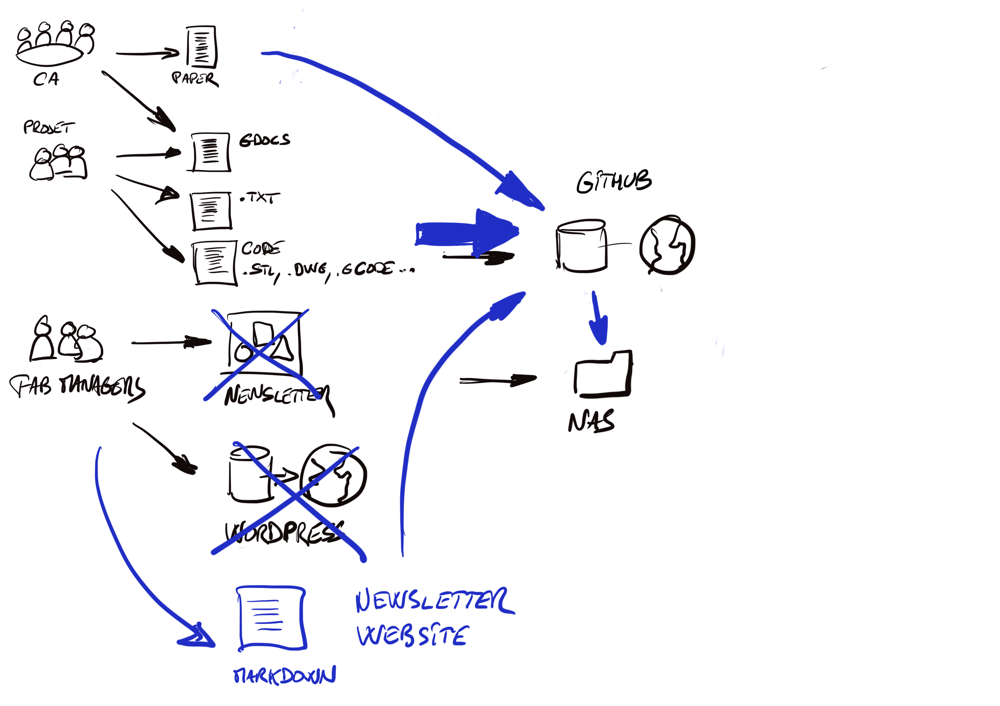

# La solution proposée

# Pour le conseil d'Administration
Les compte-rendus continuent d'être écrits en utilisant Dropbox Paper.
Les documents sont exportés en fichier markdown pour être intégrés.

# Pour les fabmanagers
Les newsletters sont écrits en markdown.
La partie contenu texte du site web est écrite en markdown.
Les fichiers sont stockés sur Github et récupérés automatiquement par le serveur de fichiers.

# Pour les adhérents
Les documents texte de leurs projets sont écrits ou convertis en markdown.
Les fichiers de code source peuvent être stockés avec la documentation.

 
